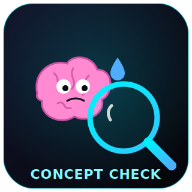

  

# Concept Check — Track A (100xEngineers Cohort 7 Hackathon)

A tool that tells a learner whether they truly understand a systems concept, or only
recognize the words for it. It finds the one place an explanation stops being a
derivation and becomes a memorized label, hands one sharp follow-up, and checks
whether the learner can then derive the *why*.

**Live app:** https://hackathon-c7.onrender.com

## How it works (the boundary — Move 3)
- **Deterministic** (Supabase Postgres + RLS): the fixed concept list, every session
  and attempt, the gap→result link, and the access rules. The frontend talks to
  Supabase with the user's own token, so row-level security is enforced.
- **Probabilistic** (Groq / Llama 3.3, in `main.py`): the only place the LLM lives.
  It finds the gap, writes one follow-up, and judges whether the learner derived the
  **causal "why / what-breaks"** — NOT whether they used jargon (the Eddie clause).
  It must return the exact proof sentence so a hollow pass is visible.

## Data model (Move 4)
`concepts` (seed) → `sessions` (per learner+concept) → `attempts`. The load-bearing
field is `attempts.gap_closed` — the link from the named gap to the second-pass
result. Row-level security proven by a two-user isolation test (`evidence/move4-rls-test.md`).

## Stack
FastAPI · Supabase (Postgres + Auth + RLS) · Groq Llama 3.3 · Render · plain HTML/JS.

## Repo contents
- `main.py` — backend + the boxed LLM judge
- `index.html` — the learner-facing app
- `schema.sql` — tables + RLS + seed
- `HYPOTHESIS.md` — Move 2 bet + kill-number (first commit, before code)
- `move1-record.md` — Move 1 sessions (3 people)
- `MOVE3_design.md` — boundary design
- `evidence/` — audio, transcripts, hand-drawn diagrams, RLS test
- `RULES.md` — hackathon reference
